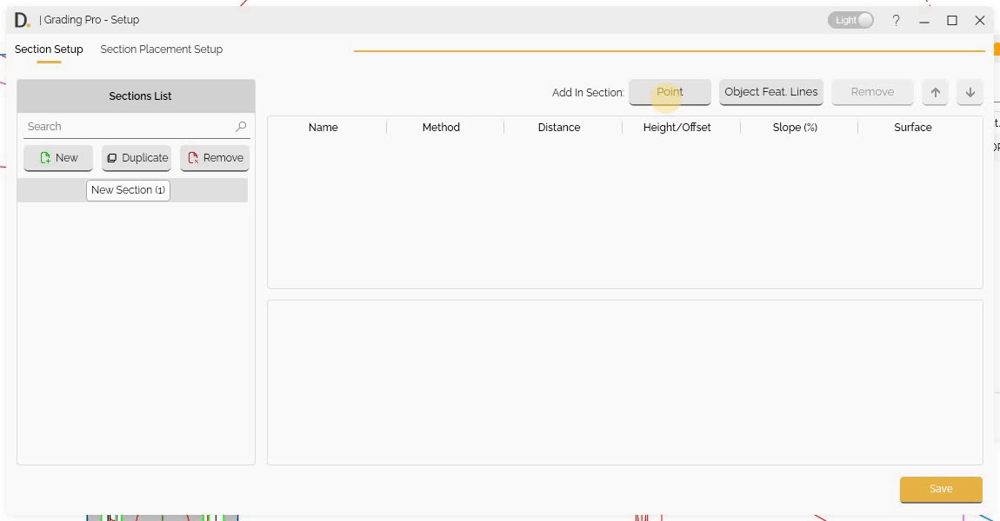
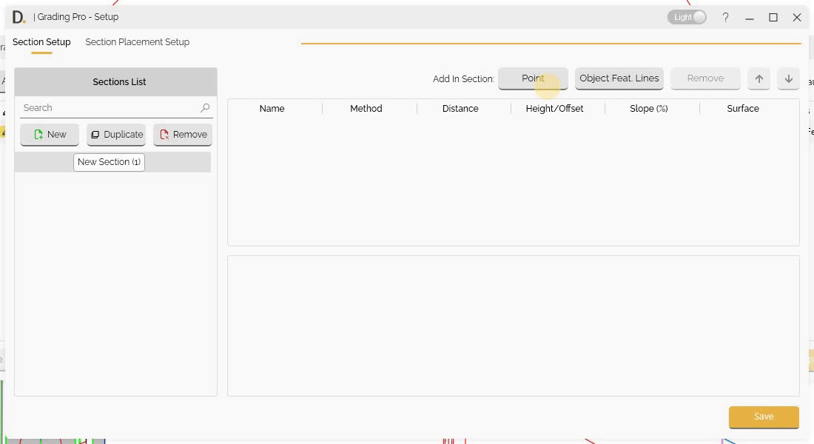
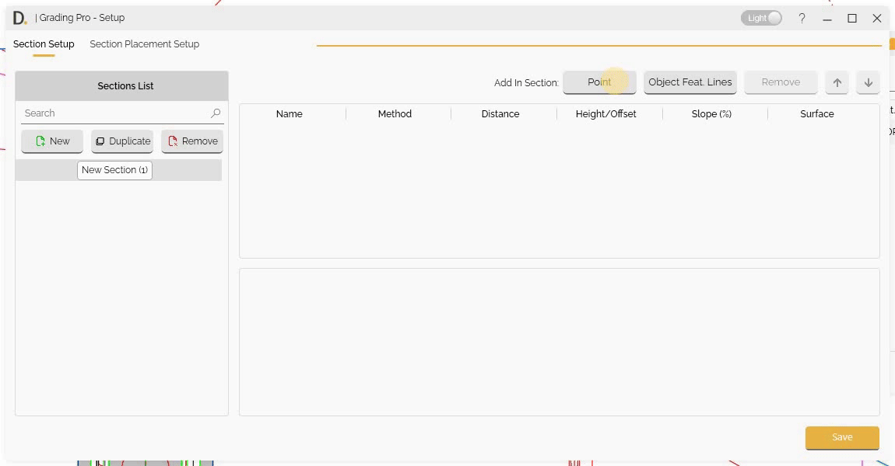
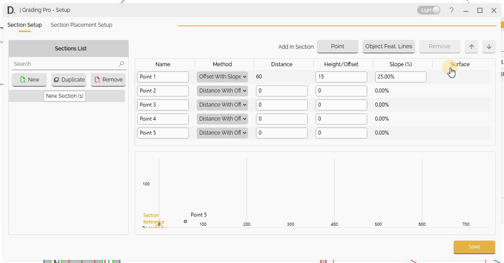

# Section Setup
{: .no_toc }

## Table of contents
{: .no_toc .text-delta }

1. TOC
{:toc}

---

# Section Setup

Grading Pro provides a section setup capability with multiple definition methods for precise grading design.

## Overview

Section configuration allows you to:
- Create Section types that can be reused across projects.
- Define sections using multiple methods (distance with offset, distance with slope, offset with slope, slope to surface)
- Setup section points efficiently with add, remove, and reorder capabilities
- Shows each point location on the section view.
- Add feature lines as objects in your section definitions for greater control and flexibility

## Manage Sections

### Creating, Duplicating and Removing

Manage your Section list by creating new, setting a associated name to later refer to the configuration, duplicating and removing new types

Note: the version on the image may not reflect the [latest version of DiCivil Package](https://diroots.com/civil3D-plugins/DiCivil/).

## Definition Methods

After creating a new section, select on the left and start adding points in the section. On each point definition, the user can define the following different methods.

### Distance with Offset

Define a point based on distance and offset:

- **Distance** - Specify distance from the previous point or origin
- **Height/Offset** - Specify offset values from the previous point or origin

Note: the version on the image may not reflect the [latest version of DiCivil Package](https://diroots.com/civil3D-plugins/DiCivil/).

### Distance with Slope

Define a point based on distance and slope:

- **Distance** - Specify distance from the previous point or origin
- **Slope Percentage** - Specify slope percentage for point or origin

Note: the version on the image may not reflect the [latest version of DiCivil Package](https://diroots.com/civil3D-plugins/DiCivil/).

### Offset with Slope

Define a point by offset and slope:

- **Height/Offset** - Specify offset values from the previous point or origin
- **Slope Percentage** - Specify slope percentage for point elevation

Note: the version on the image may not reflect the [latest version of DiCivil Package](https://diroots.com/civil3D-plugins/DiCivil/).

### Slope to Surface

Define points by slope from the previous point projected to the selected surface:

- **Offset from Path** - Specify offset distance from the reference path
- **Slope Percentage** - Specify slope percentage for point elevation

Note: the version on the image may not reflect the [latest version of DiCivil Package](https://diroots.com/civil3D-plugins/DiCivil/).

## Point Management

### First Point

- The first point could be placed on the origin (0, 0) or at a distance offset from the origin.

Note: the version on the image may not reflect the [latest version of DiCivil Package](https://diroots.com/civil3D-plugins/DiCivil/).

### Adding and Removing Points

Add or remove points to section setups:

Note: the version on the image may not reflect the [latest version of DiCivil Package](https://diroots.com/civil3D-plugins/DiCivil/).

### Reordering Points

Reorder points in section definitions:

Note: the version on the image may not reflect the [latest version of DiCivil Package](https://diroots.com/civil3D-plugins/DiCivil/).

## Object Feature Line Integration

Grading Pro allows you to add feature lines as objects in your section definitions, providing greater control and flexibility in grading design.

### Overview

Feature line integration enables you to:
- Use existing feature lines of platforms, or other geometric objects as part of your section definitions
- Maintain exact geometry from existing designs while incorporating them into new grading scenarios
- Achieve precise control over complex geometric forms
- Ensure design consistency with existing elements

### Adding Object Feature Lines into Sections

Follow these steps to add feature lines to your section definitions:

1. **Open Section Setup**  
   Go to the "Section Setup" tab within Grading Pro.

2. **Add Object Feature Lines**  
   Click the "Object Feat. Lines" button to begin the integration process.

3. **Select Feature Lines or Objects**  
   Choose the set of feature lines like platforms, or other geometric objects you want to include in your section.

4. **Specify Origin Point**  
   Select where the feature line will connect to the section. You can choose the midpoint, an endpoint, or a custom point along the feature line. The origin point determines how the feature line is positioned within the section and the elevation referenced from the object is at zero.

5. **Set Orientation**  
   Define the orientation by selecting which end or direction the feature line should follow. Adjust rotation or placement as needed to ensure the feature line aligns correctly with your section design.

Note: the version on the image may not reflect the [latest version of DiCivil Package](https://diroots.com/civil3D-plugins/DiCivil/).

### Applications

Feature line integration supports various grading design scenarios.

- **Reusable Objects** - Create standard feature line elements that can be applied across multiple sections, saving time while maintaining consistent design quality and workflow efficiency
