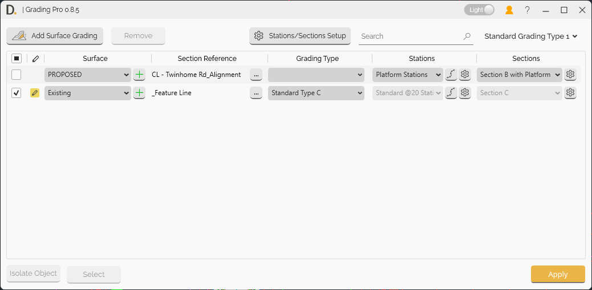

# Grading Pro User Guide

Learn how to use Grading Pro to create or modify surfaces reusable across different project.

  

{: .fs-6 .fw-300 }

## Overview

Grading Pro modifies or creates surfaces based on sections positioned from a reference. The defined sections and setup can be stored and reused across projects. Whether you're designing proposed terrain, pads, or optimizing cut/fill, Grading Pro takes the complexity out of site grading with multi-criteria reusable surface design.

**Key Features:**
- **Add Surface Grading** - Main functionality to modify surfaces with defined sections
- **Station/Section Setup** - Three-tab interface for stations, sections, and grading types
- **Multiple Section Definition Methods** - Points defining object feature lines on the section plane and a group of feature lines.
- **Flexible Station Management** - Individual and range-based stations configurations
- **Template System** - Save and reuse configurations across projects
- **Search and Filter** - Quickly find specific configurations in large projects
- **Theme Support** - Dark and light mode options

## Getting Started

### Main Interface

The Grading Pro tool is accessed through the DiRoots tab in Civil 3D. The main UI provides:

- **Add Surface Grading** button - Primary function to modify and create new surfaces
- **Surface Selection** - Choose existing surfaces to modify
- **Section Reference Placement** - Define the section reference path for section placement
- **Grading Type Selection** - Choose predefined configurations or create new ones
- **Section Selection** - Select your section setups.
- **Station Selection** - Select your stations that set your sections.

  
Note: the version on the image may not reflect the [latest version of DiCivil Package](https://diroots.com/Civil 3D-plugins/DiCivil/).

### Basic Workflow

1. **Open Grading Pro** from the DiRoots tab
2. **Select Surface** - Choose the surface to modify
3. **Select Path** - Choose alignment or path for section placement
4. ** Select Grading Type** - Set up stations and sections
5. **Apply Changes** - Execute the surface modifications

> **GIF Placeholder:** Demonstrate the complete workflow from opening to applying changes

 Section Setup
 Different methods in section
 Station Setup
 Adding Feature Lines Objects
 Grading Type Setup
6. Section Reference Modes.
7. Creation of a new surface.
8. Full workflow and update
9. Profile and reusing it in multiple projects.
