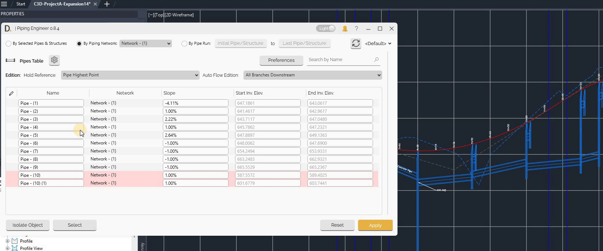
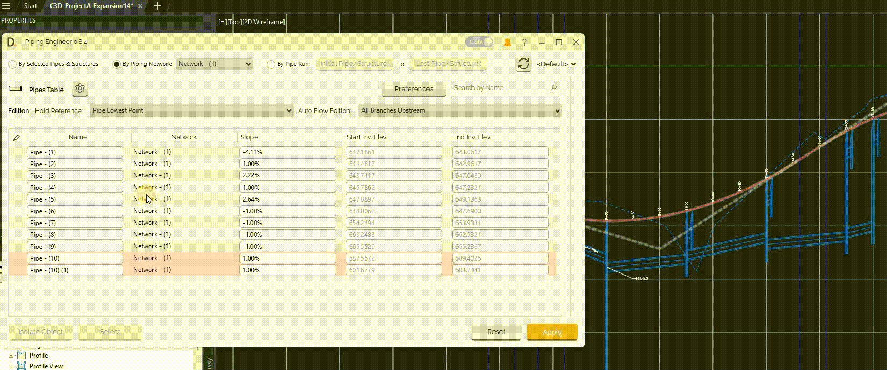

# Elevation Design
{: .no_toc }

## Table of contents
{: .no_toc .text-delta }

1. TOC
{:toc}

---

# Elevation Design

Piping Engineer provides advanced elevation design capabilities with auto-edition mode that includes hold reference options and automatic flow direction adjustments.

## Overview

Elevation design allows you to:
- Control piping network elevations with multiple reference strategies
- Automatically adjust upstream/downstream pipes based on flow direction
- Maintain system integrity during elevation modifications

By modifying the 'Slope', 'Start Invert Elevation', 'End Invert Elevation' and using the Edition Modes inputs of 'Hold Reference' and 'Auto flow Edition', the user can design easilly their pipes in elevation.

## Elevation Design Modes

### 1. Auto-Flow Edition Modes
The auto flow edition modes allow to auto modify the pipes after the edited elements to maintain system connectivity.  The following options are allowed: 'All Branches Downstream', 'All Branches Upstream', 'Only Selection'.

Auto Flow Logic: 
The modification to maintain the piping system connectivity moves the pipe system keeping the same slope. The pipe system is automatically moved up/down if the new edited pipe position doesn't longer allow the system to flow by gravity. See example Example 1, 2.

### 1.1 All Branches Downstream

Automatically adjust all downstream pipes from the edited ones to keep the connectivity. See workflow example 1.
- Preserves the slopes of pipes downstream.

### 1.2 All Branches Upstream

Automatically adjust all upstream pipes from the edited ones to keep the connectivity. See workflow example 2.
- Preserves the slopes of the pipes upstream.

### 1.3 Only Selection

- **Modify only selected elements** without affecting the rest of the system (as auto flow Upstream and Downstream). See workflow example 3.

### 2. Hold Reference Modes

The tool has the following options to hold or keep an existing reference so the pipes are modified maintaining their current reference elevation or slope 

### 2.1 Hold Reference: Pipe Highest Point

Holds the highest point from the edited pipes as the elevation reference and allows to adjusts the slope. The user can modify multiple rows slope at the same time.

### 2.2 Hold Reference: Pipe Lowest Point

Holds the lowest point from the edited pipes as the elevation reference and allows to adjusts the slope. The user can modify multiple rows slope at the same time.

### 2.3 Hold Slope

Holds the slope of the edited pipes. The user can adjust start/end elevations and moves the entire system up/down with the difference value.

- Move entire system up or down while preserving slopes. Value moved is the difference between the edited and previous value.
- Only elevation values can be changed

### 2.4 Hold Reference: Pipe Start or Pipe End

Holds the pipe start or pipe end as the elevation reference, the user can alternativally modify the slope holding the same pipe start or end reference:

- **Pipe Start**. References the starting point elevation of the pipe
- **Pipe End**. Reference the ending point elevation of the pipe
- In this mode the user can modify the elevations directly using the edition modes 

## General Workflow

1. Refresh the latest data.
2. Identify the pipes to move.
3. Define the Hold Reference.
2. Define the Auto Flow Edition.
5. Set the pipe(s) new values.
4. Apply changes.

## Workflow Examples

### Example 1: Adjusting Multiple Pipes Slope and Auto Editing Downstream

-  **Identify pipes** that need adjustment
-  **Set Hold Reference and Auto-flow edition modes**. Set the hold reference to the highest point of edited pipes. Set auto-flow edition** to "All Branches Downstream"
-  **Set pipe new values** Enter new slope in multiple pipes (e.g., 3%,)
-  **Apply changes** - system adjusts selected pipes and all downstream pipes

  
Note: the version on the image may not reflect the [latest version of DiCivil Package](https://diroots.com/Civil 3D-plugins/DiCivil/).

### Example 2: Adjusting Multiple Pipes Slope and Auto Editing Upstream

- **Identify pipes** that need adjustment
- **Set Hold Reference and Auto-flow edition modes** Set the hold reference to the lowest point of edited pipes. Set auto-flow edition** to "All Branches Upstream"
- **Set pipe new values** Enter new slope in multiple pipes (e.g., 2.5%,)
-  **Apply changes** - system adjusts selected pipes and all downstream pipes

Note: the version on the image may not reflect the [latest version of DiCivil Package](https://diroots.com/Civil 3D-plugins/DiCivil/).

### Example 3: Moving System Down While Preserving Slopes

- **Identify pipes** to modify. In this case the fist pipe or pipes of the system (for 'Only selection' mode) to move up or down 
- **Set Hold Reference and Auto-flow edition modes** Set the hold reference to the 'Hold Slope'. Set auto-flow edition "Only Selection"
- **Modify elevation** (e.g., from 648 to 650 - moving system up 2 units)
- **Apply changes** - system moves up while preserving all slopes

  
Note: the version on the image may not reflect the [latest version of DiCivil Package](https://diroots.com/Civil 3D-plugins/DiCivil/).

### Example 4: Modifying Pipe Slope from Start/End Pipe Reference

- **Identify specific pipe** to modify
- **Set Hold Reference and Auto-flow edition modes** Choose "Only Selection"** for auto-flow edition mode
- **Modify  slope** as needed
- **Apply changes** - Selected pipes are modified and system downstream or upstream based on auto-flow mode.

Note: the version on the image may not reflect the [latest version of DiCivil Package](https://diroots.com/Civil 3D-plugins/DiCivil/).

### Example 5: Modifying Pipes Holding their Start Elevation 

1. **Select specific pipe** to modify
2. **Choose "Only Selection"** for auto-flow edition mode
3. **Modify elevation** as needed
4. **Apply changes** - Selected pipes are modified and system downstream or upstream based on auto-flow mode.

  
Note: the version on the image may not reflect the [latest version of DiCivil Package](https://diroots.com/Civil 3D-plugins/DiCivil/).

