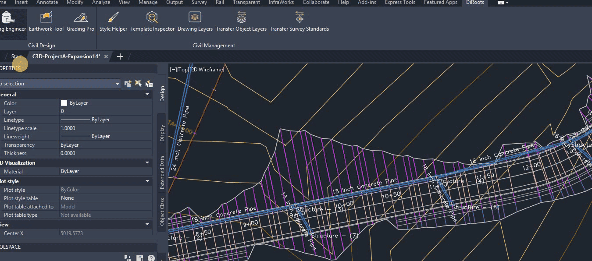

# Pipe and Structure Data Tables
{: .no_toc }

## Table of contents
{: .no_toc .text-delta }

1. TOC
{:toc}

---

# Pipe and Structure Data Tables

Piping Engineer provides comprehensive table interfaces for managing pipes and structures with efficient data management and bulk operations capabilities.

## Overview

Pipe and structure data tables allow you to:

- Manage the pipes and structures data through independent table interfaces
- Perform bulk operations on multiple elements

## Features

### Selecting Network Data

The tool provides 3 modes to select your network data to display:

- **By Selection of Pipes/Structures** - Select the objects to show.
- **By Piping Network** - Select the network to display the data.
- **By Pipe Run** - Select the initial and last Pipe/Structure.

  
Note: the version on the image may not reflect the [latest version of DiCivil Package](https://diroots.com/Civil 3D-plugins/DiCivil/).

### Rule Validation Display

The tool displays hightligted in red background color the pipes/structures elements that are not complying with the rules

  
Note: the version on the image may not reflect the [latest version of DiCivil Package](https://diroots.com/Civil 3D-plugins/DiCivil/).

# Quick Slope Override Rule 

Piping Engineer allows users to define a quick rule to check the slope range in the tool.

  
Note: the version on the image may not reflect the [latest version of DiCivil Package](https://diroots.com/Civil 3D-plugins/DiCivil/).

### Refreshing Latest Data

The tool has a refresh button to update the latest data from the file.

  
Note: the version on the image may not reflect the [latest version of DiCivil Package](https://diroots.com/Civil 3D-plugins/DiCivil/).

### Table Column Preferences Customization

The tools allows you to customize the data columns you want to show in each of your tables.

  
Note: the version on the image may not reflect the [latest version of DiCivil Package](https://diroots.com/Civil 3D-plugins/DiCivil/).

  
Note: the version on the image may not reflect the [latest version of DiCivil Package](https://diroots.com/Civil 3D-plugins/DiCivil/).

### Basic Workflow

1. **Open Piping Engineer** from the DiRoots tab
2. **Select Network** - Choose the piping network to work with
3. **Choose Tool** - Select the appropriate tool (Elevation Design, Slope Validation, etc.)
4. **Configure Settings** - Set up tool-specific parameters and options
5. **Apply Changes** - Execute modifications and validate results
6. **Save Profile** - Save configurations for future use

