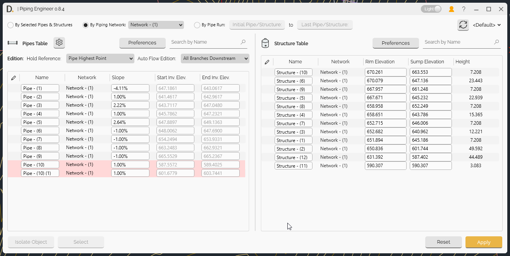

# Piping Engineer User Guide

Learn how to use DiCivil - Piping Engineer to design, edit and validate your piping networks faster and easily.

  

{: .fs-6 .fw-300 }

## Overview

Piping Engineer is a comprehensive tool for designing, editing, and validating Civil 3D piping networks. The tool provides advanced elevation design capabilities, slope validation, system data edition features, and comprehensive pipe and structure management with table interfaces.

**Key Features:**
- **Elevation Design** - Advanced elevation control with hold reference options and auto-flow edition
- **Slope Validation** - Comprehensive slope validation and optimization tools
- **System Edition** - Flexible system modification with multiple editing modes
- **Pipes and Structures Tables** - Comprehensive table interface for pipe and structure management
- **Profile Management** - Save and reuse configuration profiles
- **Auto-Flow Adjustment** - Automatic upstream/downstream adjustments

## Getting Started

### Main Interface

Piping Engineer provides an interface for managing Civil 3D piping networks with multiple specialized tools and table interfaces for efficient network design and validation of pipes and structures networks.

  
Note: the version on the image may not reflect the [latest version of DiCivil Package](https://diroots.com/Civil 3D-plugins/DiCivil/).

GIFS:
1)Full WF: Select system, add columns, bulk modify data, check.
2)Profile saving.
3)Bulk edition, refresh.